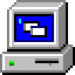

<div align='center'></div>
<h1 align='center'> Win95 newtab </h1>
<p align='center'>Win95 newtab is a customizeable themed newtab page inspired by windows 95/vaporwave.
<div align='center'>
<a href='https://chrome.google.com/webstore/detail/win95-newtab/jldkfnpihcmhefmocabimamogcmmmeia'>
</a>
<a href='https://addons.mozilla.org/en-US/firefox/addon/win95-newtab/'></a>
</div>

# Getting started

To start developing you first need to run a few commands to get set up properly.

This project uses NPM for some basic dependencies and dev tools.

This project uses Gulp.js for defining tasks that aid in development.

The main dependencies are Jquery and bootstrap.

To get started run these commands:

```
npm install
gulp compileStyle
gulp prepareLibs
```

### Creating a release archive

To create a release version use the following command:

```
gulp prepareRelease
```

This will first copy everything over to the dist folder, minifies the javascript, compiles the sass and then packs it into a timestamped zip.

The result can be found in the release archive folder.

## Debugging

To debug, install the src version of the extension.

### Chrome

Go to settings -> extensions -> load unpacked -> select the src folder

### Firefox

Go to settings -> extensions and themes -> press the cog wheel top right -> debug addons -> load temporary addon -> select manifest.json in the src folder

# Contributing guidelines

I opted to use a eslint to enforce a consistent codestyle. The repo includes the eslint config files and it will thus be enforced.

To make it easier you can use the prettier eslint vscode extension which automatically formats your code based on the eslint config.
It's available in npm aswell if you want to use that instead.

For html and sass there really are no guidelines at the moment.

# FAQ

### Why no webpack or any other bundler?

This is something i want to move to eventually, i've tried before but it was too much of a headache.

### Why Jquery and not a framework like Vue, angular, etc?

I wanted to keep this extension as light as possible, however,
since refactoring a thing or two i realize going with something like vue might not have been such a bad idea.

I might try and port it to vue somewhere down the line and see how it performs.

# Copyright

I do **not** own any of the assets found in this repo, this includes icons, wallpapers, fonts, libraries, etc.
All rights belong to their respective owners.

You are free to do whatever with my code.
